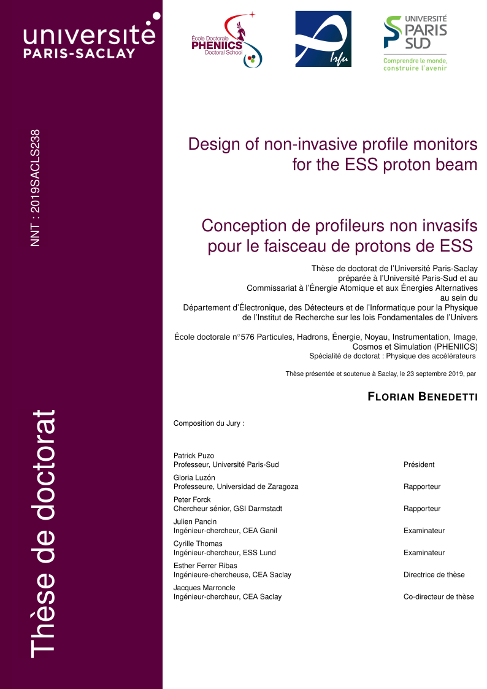

# PhD Thesis

This repository contains the LaTeX sources and others resources (pictures, tables, bibliography entries) required to build the manuscript.
The thesis itself deals about the development of beam diagnostic for the European Spallation Source.

## Requirements

The build automation is done by __Make__ using __LuaLaTeX__ as LaTeX processor. PDFLaTeX and XeLaTeX may work with some modifications of build files.
All TikZ pictures are exported to SVG by __Inkscape__, so they can be reused in external software like PowerPoint. The bibliography use BibLaTeX format and __biber__ tool. A glossary is also created thank to __makeglossaries__ tool.

Therefore, several LaTeX packages are mandatory:
| Packages   | Short description of usages in the manuscript |
|------------|-----------------------------------------------|
| appendix   | Create the appendix at the end of thesis      |
| array      | Array in tables                               |
| asmath     | Equations numbering                           |
| BibLaTeX   | Bibliography                                  |
| Biber      | Bibliography                                  |
| booktabs   | Fancy tables                                  |
| circuitikz | Circuit schematic                             |
| fancyhdr   | Fancy header and footer                       |
| glossaries | Glossary support                              |
| graphicx   | Include pictures                              |
| helvet     | Helvetica support (if needed)                 |
| hyperref   | Support link inside PDF                       |
| lipsum     | Lipsum generator                              |
| lmodern    | Vectorial modern font                         |
| multicol   | Advanced tables                               |
| minitoc    | Fancy ToC at beginning of chapter             |
| url        | Support url link                              |
| shellesc   | Shell command from LaTeX                      |
| subcaption | Multiple captions per subfigure               |
| svg        | Include SVG files                             |
| textpos    | Fine text positioning                         |
| TikZ       | Scheme, draft and plot                        |
| wrapfig    | Wraps figure and tables                       |
| xcolor     | Advenced color support                        |

## Copyright issues

I tried to respect much as possible the copyright for images but sometimes the copyright statement is not clear. In any case the sources of pictures are always given in bibliography entries. As well some part of the thesis contains template forms from the Paris Saclay University, and again the copyright statement is not clear.

The remaining of the thesis is therefore under the attribution-NonCommercial-ShareAlike 4.0 International CC licence.

<dl>
 Design of non-invasive profile monitors for the ESS proton beam by <a xmlns:cc="http://creativecommons.org/ns#" href="https://github.com/FlorianBen/PhDThesis" property="cc:attributionName" rel="cc:attributionURL">Florian Benedetti</a> is licensed under a <a rel="license" href="http://creativecommons.org/licenses/by-nc-sa/4.0/">Creative Commons Attribution-NonCommercial-ShareAlike 4.0 International License</a>.
</dl>
